# Guide d'installation du client Luanti

Ce guide explique comment installer le client Luanti sur Windows 11

## Installation du client Luanti

1. Allez sur le site officel suivant : [https://www.luanti.org/downloads/](https://www.luanti.org/downloads/)
2. Téléchargé la version correspondant à votre OS (Windows, Mac OS, Linux). Dans notre cas on vous montre comment faire pour Windows!
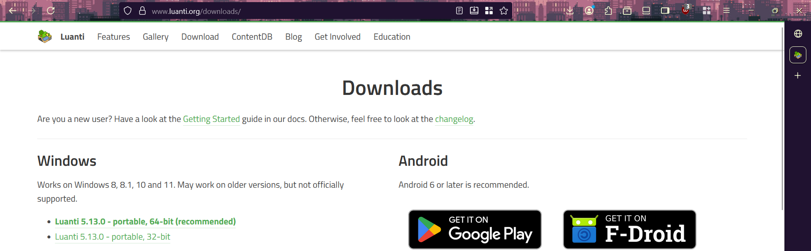

### Windows

1. Décompresser le fichier télécharger et chercher pour le dossier bin.
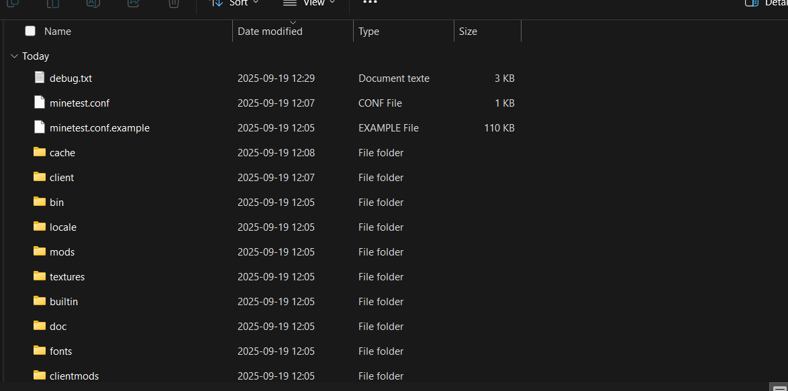

2. Lancez le fichier ce situant dans le dossier bin luanti.exe.
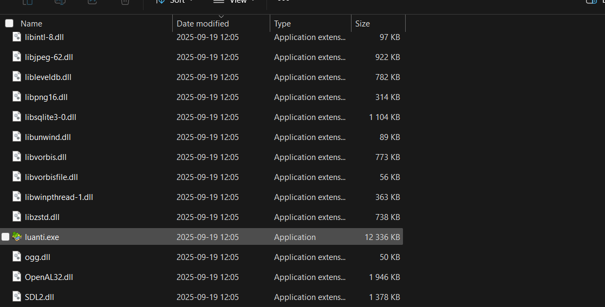

3. Et voila maintenant vous venez de lancer client Luanti
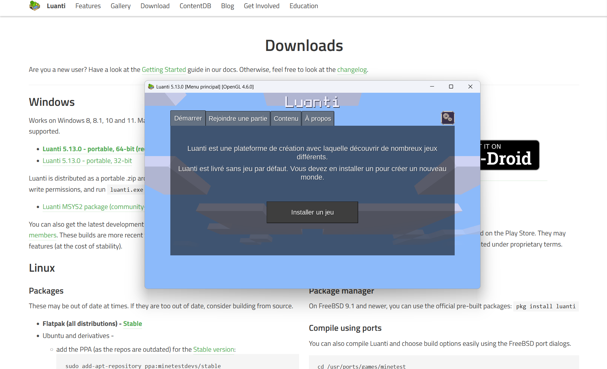

# Faire l'installation de Minetest ou Mineclonia.

Ce guide explique comment installer Minetest à partir de client Luanti sur Windows 11
## Installation de Minetest ou Mineclonia

1. Ouvrer l'application client Luanti et cliquez sur le boutton "Installer un jeu"

2. Cliquez sur le boutton qui présente "Minetest Game by Luanti".
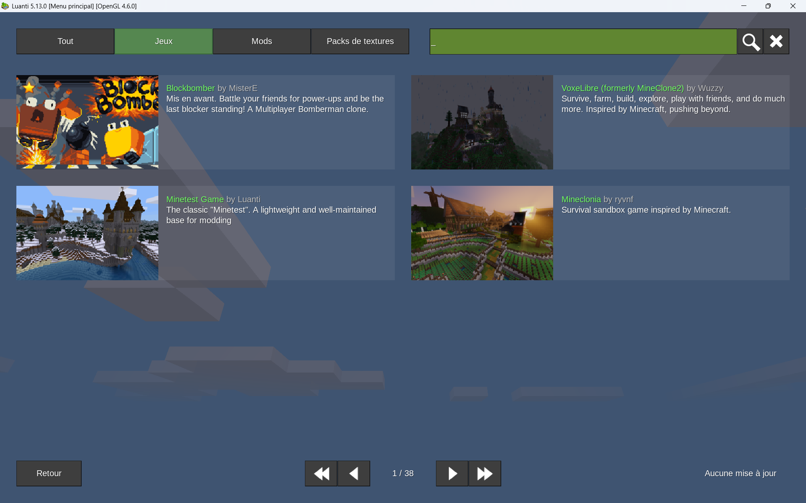

3. Cliquez ensuite sur le boutton "Installez [3.0 MB]" et cela téléchargera Minetest sur votre application Luanti.
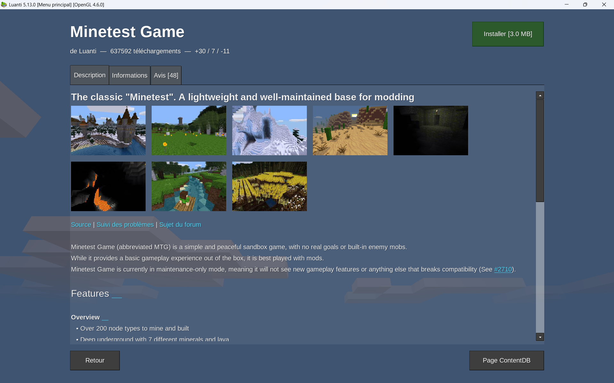

4. Pour etre sur si vous avez bien télécharger Minetest vous aurez le boutton "Désinstaller" qui remplacera l'ancien boutton.
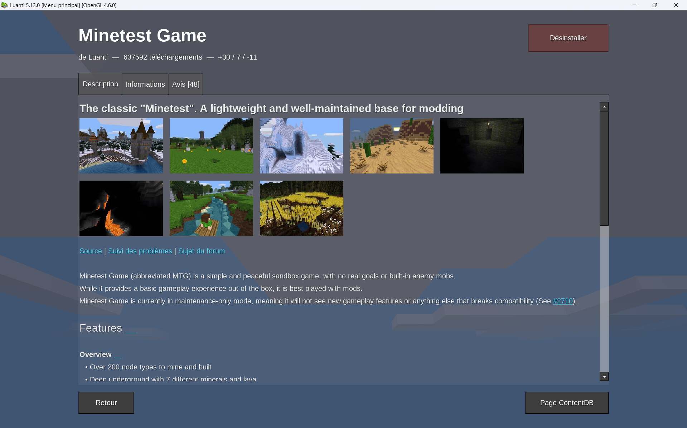

# Connexion à un serveur Minetest distant

Ce guide explique comment ce connecter à un serveur Minetest distant à travers l'application client Luanti.

## Étapes de connexion

1. Dirigez-vous vers la page d'accueil de Luanti. Par la suite cliquez sur le boutton "Rejoindre une partie".
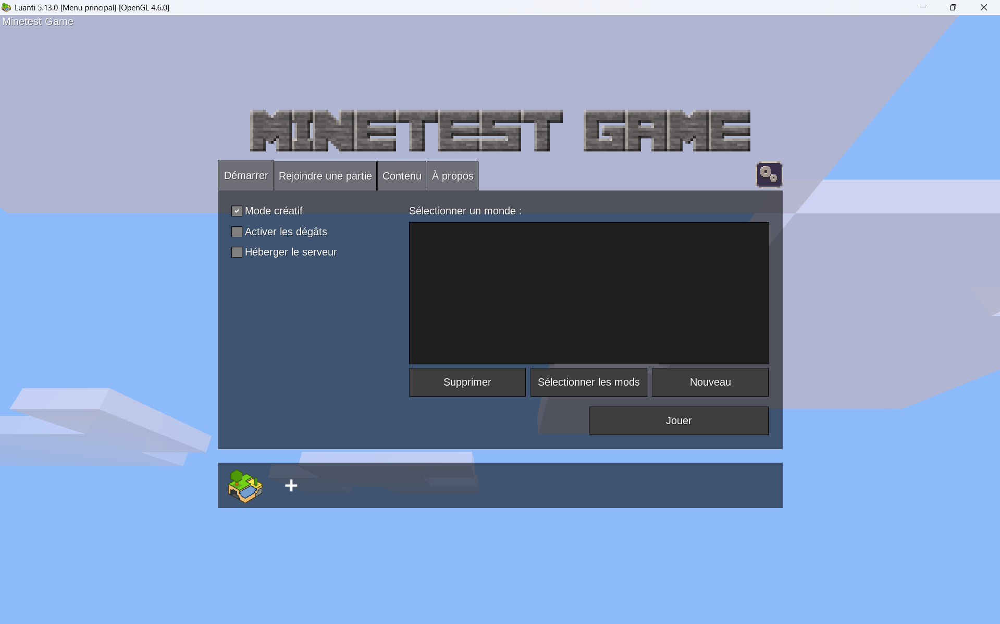

2. Sur cette page sélectionner un serveur de votre choix et par la suite cliquer sur "S'inscrire"
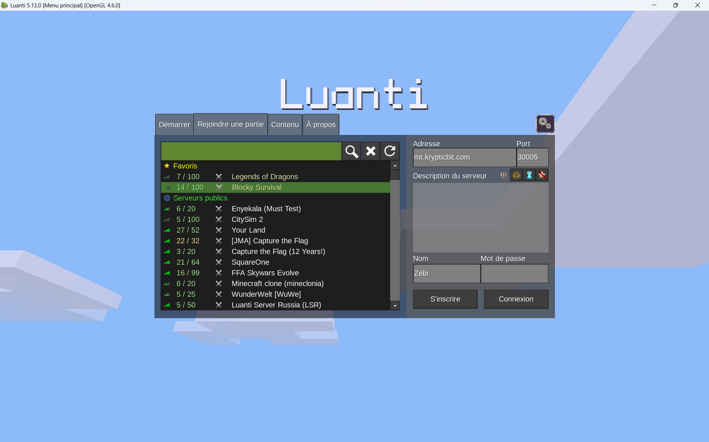

3. Créez-vous un compte avec un nom d'utilisateur et un mot de passe.
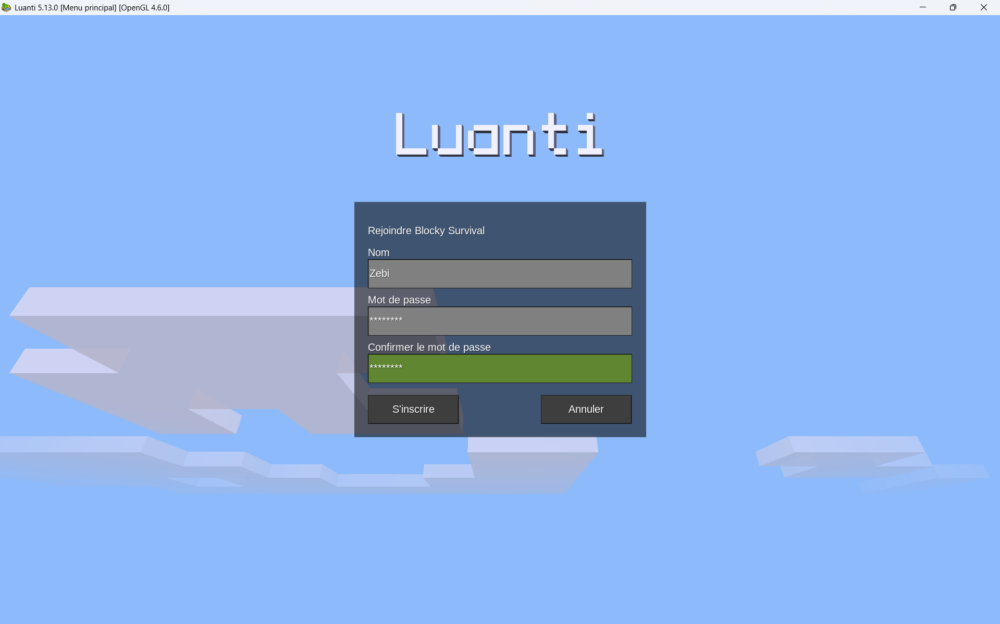

4. Par la suite entrer vos information pour vous connectez et cliquer sur le boutton "Connexion".
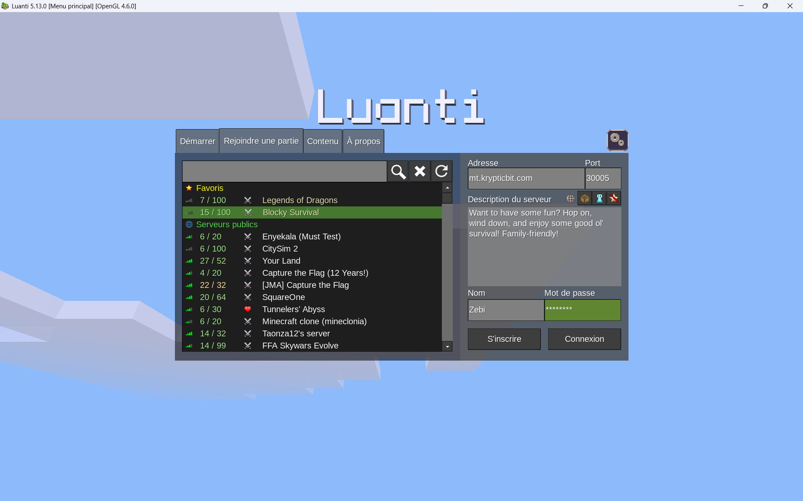

5. Maintenant attendez que que le chargement du serveur distant finit.
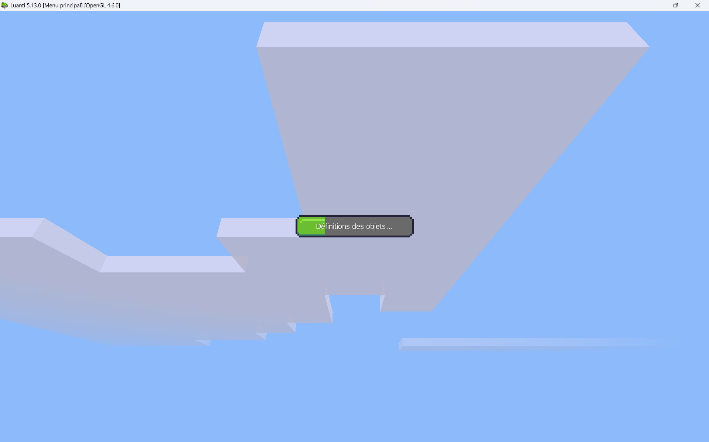

6. Après quelques secondes vous aurez une page similaire qui prouvera que la connexion à bien fonctionnée.
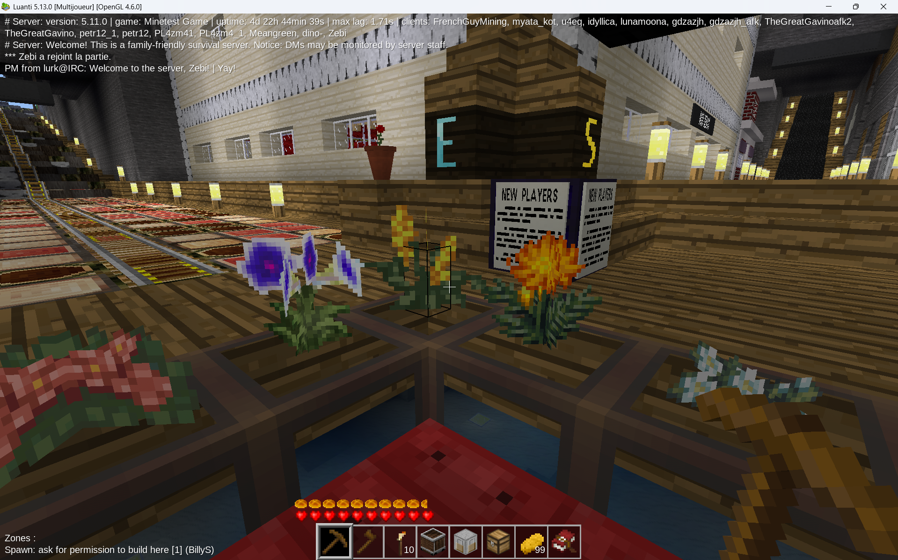

# Diagramme de réseau de la connexion entre client et serveur distant de Minetest.

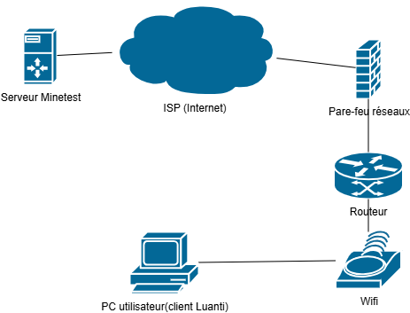